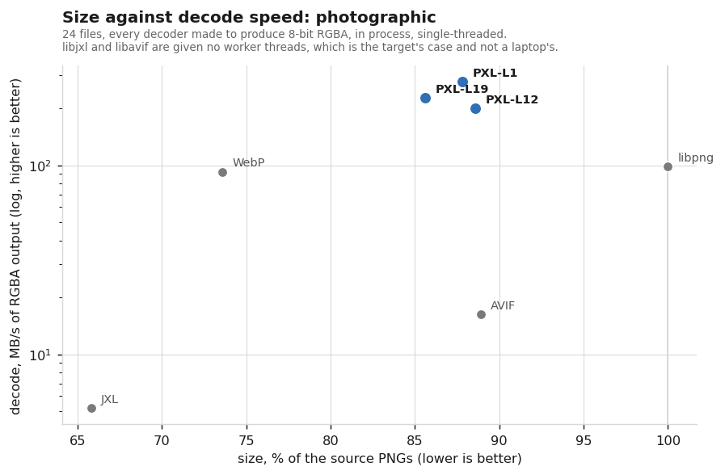
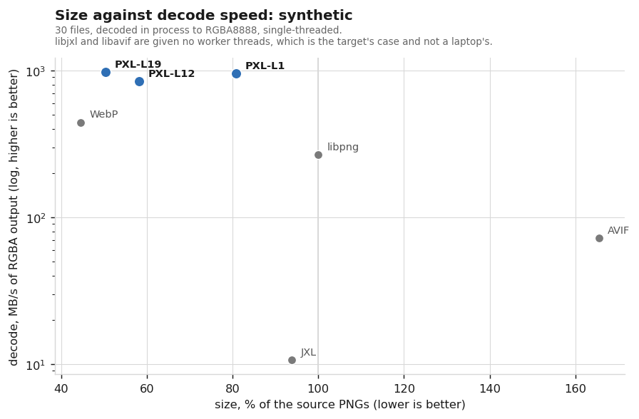
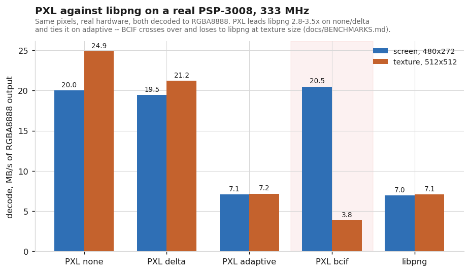
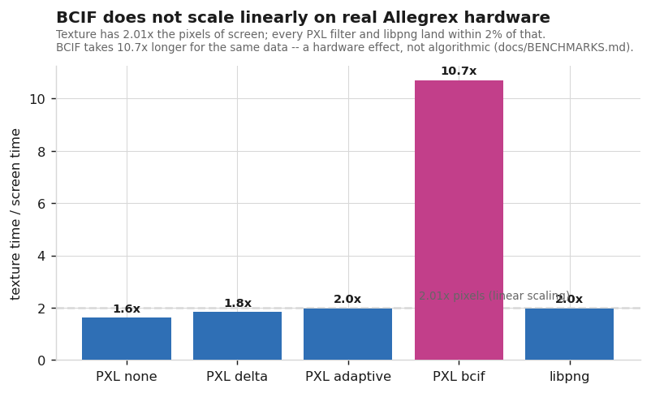
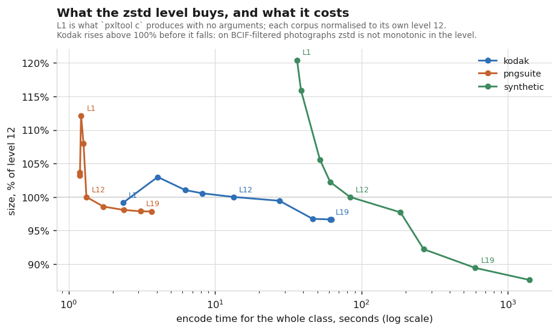
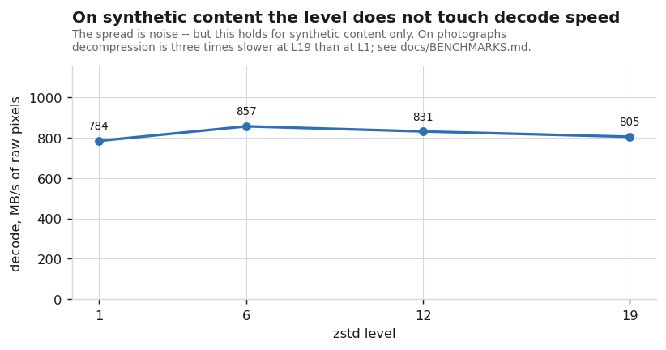

# PXL — PNG XL

A small lossless image format and library: PNG's per-row filters feeding
**Zstandard** instead of DEFLATE, with **libpng** used only to read and write
real PNG files. It descends from [Zpng](https://github.com/catid/Zpng) — filter
the pixels with a reversible colour transform, then compress with zstd.

**What it is for.** Not the smallest files. JPEG XL and WebP both compress
better and this project does not pretend otherwise. What PXL has is a decode
profile: a decoder smaller than libpng's, decoding roughly twice as fast into
raw pixels, in about the memory of the output image, a row at a time, with
metadata carried through byte for byte. Every one of those is measured below,
including where WebP beats us on both axes.

`libpxlcore` is PNG-free and depends on zstd alone, which is what lets the Qt
image plugin, the Dolphin thumbnailer and the FFmpeg module in this repository
link it without dragging libpng in.

## Where it stands

Both axes measured, one chart per content class — photographs and synthetic
stills behave differently enough that a combined figure would describe neither.
Decode is timed **in process**, every format expanded to the same RGBA8888
destination, because timing `djxl`/`dwebp`/`avifdec` would measure process
startup and writing an output file rather than decoding.





Read them as: left is smaller, up is faster, so the useful corner is top-left.

On **photographs** we are the fast one and not the small one. JPEG XL reaches
65.8% of the source PNGs where we reach 85.6%, and decodes at 5.2 MB/s against
our 200–276. libpng is at 100% and 98.6 MB/s, so PXL is about twice its speed.

On **synthetic stills** — interfaces, rendered text, diagrams, which is what a
PNG replacement actually gets pointed at — **WebP wins on both axes**: 44.6% of
the source PNGs at 570 MB/s, against our 50.3% at 485. We are ahead of libpng
(100% at 309) and that is the honest extent of it.

What does collapse there is the other two. AVIF comes out at **165%**, half
again larger than the source PNG, and JPEG XL at 93.8%, because on very flat
content that PNG already stores at 0.03 bytes per pixel their overhead exceeds
what they win. On individual 4K screenshots with alpha, JPEG XL reaches 122% and
268% while PXL holds at 56–60%.

Two caveats belong with those numbers. Every decoder runs single-threaded, and
libjxl and libavif are given no worker threads — the right comparison for this
project's target and the wrong one for a desktop. And every decoder, PXL
included, is made to produce 8-bit RGBA, because throughput is not comparable
between a three-channel output and a four-channel one; an earlier version of
this chart did not do that and overstated PXL by about a third.

## Format philosophy

Take PNG's understandable architecture, keep its strengths, drop the obsolete
parts, and do it without turning the format into a sprawling research project.
The target floor is a Sony PSP: 32 MB RAM, 32-bit little-endian, no fast
floating point. That floor is also where the geometry limit comes from — the
PSP screen is 480x272, and nobody needs huge pictures there.

Priorities, in order:

1. **Decode speed.** A file is encoded once and read thousands of times.
2. **Decoder size.** A requirement of the target hardware, not cosmetics.
3. **A simple, reproducible specification.** Implementable from
   [SPEC.md](SPEC.md) without reading this source.
4. **File size**, last on purpose.

The ground rule, learned the hard way: no change lands on the strength of an
argument, only on a measurement over a corpus, and the measurement states its
sampling. Rejected ideas are kept with their reasons in
[docs/RESEARCH.md](docs/RESEARCH.md) so they are not re-litigated; the
append-only measurement history is [docs/BENCHMARKS.md](docs/BENCHMARKS.md).

### Where each priority actually stands

**Decode speed — met.** 2.0x libpng into RGBA on photographs at level 12 (2.8x
at the default level 1), 1.5x on synthetic stills. Fastest of every lossless
codec measured on photographs; on synthetic stills WebP is faster. QOI is faster
still on photographs, and QOI does not compress.

**Decoder size — met.** 174 KB of `.text` against libpng's 210 KB, and that
counts all of libzstd statically while libpng's figure excludes the zlib it
loads dynamically; counted the same way it is 174 KB against 271 KB. Our own
decoder is 26 KB of it. This read 861 KB until the codec was split into
separate encode and decode units, which stopped the linker pulling the
compressor into decoding builds — the format was never the problem. A quick
MIPS cross-compile briefly looked 54% over this figure; chased down the same
day, that was almost entirely two measurement artefacts (`printf`/`fopen`
statically pulling in newlib internals that cost nothing on dynamically-linked
x86, and PSPSDK's own ~121 KB empty-program floor) rather than PXL's code —
net of both, MIPS is 9.6% bigger, an ordinary RISC-vs-CISC difference. See
RESEARCH.md's "Does WebP even run on PSP?" correction for the full breakdown;
an official through-the-real-build-pipeline MIPS number is still on
[`ROADMAP.md`](docs/ROADMAP.md), but not because "met" is in doubt.

**Decode-time memory — met for row-filtered stills.** The filtered stream is
consumed through a one-row window, so a 3000x3000 photograph streams in 27.6 MiB
against libpng's 26.9, down from 53.2, and a 9-megapixel image fits the 32 MB
target. The catch: BCIF has no row window and is what the encoder picks for
photographs, so the saving needs `-p` and costs 4–6.6% in size on large images.
Animation decodes in 1.03x the whole animation, the floor while the API returns
every frame.

**File size — not met as originally stated, and the target was wrong.** The
stated goal was 15% better than PNG on photographs; we are at 11.4%. On
synthetic stills, which is the content the format is actually aimed at, a
public corpus of 838 freely-licensed UI screenshots
([`bench/synthetic_png.sh`](bench/synthetic_png.sh)) puts PXL at 57.9% of the
source PNGs — but `oxipng -o 2` alone takes those same files to 68.1%, so
**85.0% is the honest compression figure** and 57.9% is what happens to PNGs as
people actually export them. Quote whichever matches the question; quoting one
alone misleads. On 8-bit grayscale plates we are at 100.3%, slightly *worse*
than PNG, because the colour filter does nothing on one channel.

### On the actual target hardware

Everything above is x86. The decoder was cross-compiled for MIPS with
`psp-gcc`/PSPSDK and run on a real PSP-3008 — see [`psp/README.md`](psp/README.md)
for the build, [`docs/BENCHMARKS.md`](docs/BENCHMARKS.md) for every number.



Three of PXL's four filters beat libpng by 2.8-3.5x, in line with the x86
numbers above. `adaptive` ties libpng rather than beating it — both are the
same per-row predictor pass over 8-bit samples, so parity here is expected,
not a regression. `BCIF` is the encoder's usual pick for photographic content
and wins at screen size (2.9x libpng, like the others) — but at texture size
it **loses to libpng outright**, decoding in about twice libpng's time.



The cause: texture (512x512) has 2.01x the pixels of screen (480x272), and
every filter except BCIF scales within 2% of that. BCIF takes 10.7x longer
for the same 2.01x more data. `unpack_bcif4` is a single linear pass, so this
is not an algorithmic problem — the leading hypothesis is cache or TLB
pressure from reading four widely-separated colour planes per pixel on a CPU
with nothing like an x86's cache, but that is a hypothesis, not a confirmed
mechanism (no PSP profiling tooling exists for this project yet).

**Choosing a filter.** The default tries every candidate and keeps whichever
compresses smallest — a size decision, not a decode-speed one. Two flags
narrow that:

- **`-p`** (`PXL_ENCODE_PROGRESSIVE`) excludes BCIF, for streaming and
  bounded memory (see [Progressive decoding](#progressive-top-to-bottom-decoding)
  below) — and, per this measurement, because BCIF loses outright to libpng
  at texture size. ADAPTIVE is still a candidate under `-p`.
- **`-s`** (`PXL_ENCODE_FAST_DECODE`) goes further: {none, delta} only, the
  two filters measured to always beat libpng in decode speed. ADAPTIVE only
  *ties* libpng rather than beating it, so `-s` drops it too. This costs more
  size than `-p` alone — 2.9% measured on 821 real UI screenshots, against
  `-p`'s own 4–6.6% for excluding BCIF — in exchange for a decode-speed
  guarantee neither the default nor `-p` makes.

**Recommendation**: on anything texture-sized or larger heading to PSP-class
hardware, encode with `-s`. Below that — icons, UI glyphs, anything
screen-sized or smaller — the default is fine, since that is exactly where
BCIF is still fast and usually smallest. One console and one synthetic
pattern measured so far; treat the exact crossover point as approximate, not
the direction of the effect.

### What the compression level buys



`pxltool c` defaults to level 1 and the tables below carry a row for each level
rather than a footnote, because the two drifted apart once already. The curve is
worth reading before choosing: on icons the level is worth 1.4%, on large
synthetic stills 12.7%, and encode time spans three orders of magnitude across
the corpora.

Two things the curve hides and the journal records. The level is **not** free at
read time:



that flat line holds for synthetic content only — on photographs zstd
decompression is three times slower at level 19 than at level 1.
And it is **not monotonic** — on BCIF-filtered photographs levels 6 and 12
produce *larger* files than level 1, and only 19 recovers.

## How it works

1. **Load** the source image with libpng into tightly packed pixels.
2. **Filter** — the encoder tries every filter applicable to the image and keeps
   whichever compresses smallest:
   - *none*: pixels stored verbatim, which wins more often than it sounds;
   - *delta*: subtract each channel from the pixel to its left (from Zpng);
   - *BCIF* (8-bit RGB/RGBA only): the colour transform `y=b, u=g−b, v=g−r`
     plus a split into separate colour planes (from Zpng);
   - *adaptive*: PNG-style per-row filters (None/Sub/Up/Average/Paeth), choosing
     a predictor per row.
3. **Compress** the filtered bytes with `ZSTD_compress`.

Decoding reverses these steps. Every filter is exactly reversible, so `.pxl` is
lossless at every bit depth; 16-bit samples keep PNG's big-endian order so
16-bit PNGs round-trip bit for bit.

Only BCIF breaks top-to-bottom streaming, because the colour-plane split means
no row is complete until the last plane byte arrives. That one property is why
BCIF also costs twice the memory and cannot decode into a texture, and why
removing it keeps coming back up in the research log.

## File format

A fixed 28-byte little-endian header, the palette section (empty unless
indexed), a metadata block (possibly empty), then one zstd frame:

| offset | size | field |
|-------:|-----:|-------|
| 0  | 4 | magic `"PXL1"` |
| 4  | 1 | version (=1) |
| 5  | 1 | channels (1–4; 1 with a palette means indexed) |
| 6  | 1 | bit depth (1, 2, 4, 8 or 16) |
| 7  | 1 | colour filter (0 delta, 1 BCIF, 2 adaptive, 3 none) |
| 8  | 4 | width (uint32) |
| 12 | 4 | height (uint32) |
| 16 | 4 | raw byte count — filtered size before compression |
| 20 | 4 | metadata byte count |
| 24 | 2 | palette count (0 = not indexed) |
| 26 | 2 | palette alpha count |
| 28 | … | palette RGB, palette alpha, metadata block, zstd frame |

The palette is structural rather than metadata: an indexed image is undecodable
without it, exactly as a PNG is without its critical `PLTE`. Sub-8-bit rows are
bit-packed as in PNG, MSB first, padded to a byte.

## Metadata (EXIF, ICC, HDR, text)

Ancillary PNG chunks are preserved byte-for-byte across a round-trip: `eXIf`
(EXIF), `iCCP` (ICC colour profile), `cICP` (HDR / BT.2100 signalling), `gAMA`,
`cHRM`, `sRGB`, `pHYs`, `tIME`, `tEXt`/`zTXt`/`iTXt`, and any unknown ancillary
chunk. They are stored in the metadata block and re-inserted when decoding back
to PNG. This holds for animation too: an `.apxl` carries one metadata block for
the whole file.

`sBIT` is kept whenever the channel layout survives — which is every image
except one whose `tRNS` becomes a real alpha channel — because it is what tells
a reader that a 16-bit file really carries 10 or 12 significant bits. Packing
such samples instead was measured and rejected: bit-packed 10-bit compresses
23% *worse* than the same data in 16-bit containers, since packing breaks the
byte alignment a byte-oriented compressor depends on.

Chunks that describe the *original* pixel layout — `tRNS`, `bKGD`,
`hIST` — are intentionally **not** carried over, because PXL canonicalizes
transparency into a real alpha channel, which would make those chunks invalid.
Sub-8-bit grayscale is *not* canonicalized: it keeps its 1/2/4-bit depth, since
expanding a bilevel scan to 8 bits costs eight times the decode memory. The one
exception is grayscale carrying `tRNS`, which does expand — the transparency
becomes an alpha channel, and there is no sub-byte alpha to hold it. `PLTE` is not carried either: an indexed
image keeps its palette in the structural section above instead. Neither are the
animation control chunks `acTL`/`fcTL`/`fdAT`, which are structural in the way
`IDAT` is and are regenerated by the encoder.

Through the FFmpeg module the picture is narrower, bounded by what FFmpeg itself
models; [`ffmpeg/README.md`](ffmpeg/README.md) has the table.

## Build

Requires a C99 compiler, CMake ≥ 3.10, and libpng + zstd.

```sh
cmake -B build
cmake --build build -j
ctest --test-dir build --output-on-failure
```

The suite covers lossless round-trips at every bit depth, PNG and APNG interop,
progressive streaming, and a malformed-input fuzz pass over the decoders. It
also decodes `.pxl`/`.apxl` references written by an *earlier* build and compares
them against the source pixels — the one check a round-trip cannot make, since a
round-trip only proves the encoder agrees with itself.

Since decoders run on untrusted files, they are also soaked under sanitizers
(this is what CI does, and how three memory-safety bugs were found):

```sh
cmake -B build-asan -DPXL_SANITIZE=ON -DCMAKE_BUILD_TYPE=Debug
cmake --build build-asan -j
ASAN_OPTIONS=detect_leaks=1 ./build-asan/pxl_fuzz_decode 300000
ASAN_OPTIONS=detect_leaks=1 ctest --test-dir build-asan --output-on-failure
```

By default it links the **system** libpng/zstd via pkg-config. To build against
the bundled sources instead (used by CI for reproducible, version-pinned
rebuilds) requires the git submodules under `vendor/`:

```sh
git submodule update --init --recursive
cmake -B build -DPXL_VENDORED=ON
cmake --build build -j
```

## CLI

```sh
pxltool c     in.png  out.pxl  [-l LEVEL] [-p]  # PNG -> PXL (-p = progressive)
pxltool d     in.pxl  out.png              # PXL  -> PNG
pxltool info  in.pxl                       # print header + stats
pxltool ca    in.apng out.apxl [-l LEVEL]  # APNG -> APXL (animation)
pxltool da    in.apxl out.apng             # APXL -> APNG
pxltool ainfo in.apxl                      # print animation header + frame modes
```

`LEVEL` is the zstd compression level, 1–22. Stills default to 1, animation to
12 — see the level curve above for what the difference is worth, which varies by
content from 1.4% to 44%.

## Animation (`.apxl`)

`.apxl` is the animated container: a canvas plus a sequence of frames. libpng
does not decode APNG, so PXL parses the `acTL`/`fcTL`/`fdAT` chunks itself and
composites each frame onto an RGBA canvas (honouring dispose/blend/offset). All
full-canvas frames are then concatenated and compressed as **one** zstd stream
with long-distance matching, so the compressor exploits the redundancy between
frames. This beats per-frame streams, temporal deltas and per-frame filtering,
all of which break cross-frame byte matches — measured, not assumed.

That single stream is already a COPY primitive: an LZ match *is* "copy these
bytes from further back". Motion vectors were measured as a possible addition
and **rejected** — on hand-drawn animation a displaced copy reaches under 1% of
blocks, because frames are redrawn rather than translated. The control case, a
pure scroll, reads 88%, so the tool works and the content simply has no motion
to find. See [docs/RESEARCH.md](docs/RESEARCH.md).

Round-trips are pixel-exact and the regenerated APNG is accepted by third-party
tools (verified with apngdis 2.9). The container is defined in
[SPEC.md](SPEC.md) §10.

## Comparison with other lossless formats

PXL/APXL measured against PNG, GIF, APNG, JPEG XL, WebP, AVIF and QOI, all in
their **lossless** mode. Generated by [`bench/bench.sh`](bench/bench.sh); see
[`bench/README.md`](bench/README.md) for methodology.

Note the decode columns in the first table time `pxltool d`, which re-encodes a
PNG on the way out — the raw-decode table below it is the honest one, and the
charts at the top of this file are honest for every format.

<!-- BENCH:BEGIN -->
Measured on 2 CPU cores / 15Gi RAM, 5 runs per cell (median wall time).
Source files: [`tests/data/RGB_24bits_palette_color_test_chart.png`](tests/data/RGB_24bits_palette_color_test_chart.png)
(258×200 RGB) and [`tests/data/Animated_PNG_example_bouncing_beach_ball.apng`](tests/data/Animated_PNG_example_bouncing_beach_ball.apng)
(100×100, 20 frames). Reproduce with `bench/bench.sh`.

**Still image** (baseline: PNG)

| Format | Mode | Encode (median, ms) | Decode (median, ms) | Size (bytes) | % of baseline |
|---|---|---:|---:|---:|---:|
| PNG | lossless (native) | - | - | 30597 | 100.0% |
| PXL | lossless (native), level 1 (default) | **15** | 14 | 5994 | 19.6% |
| PXL | lossless (native), level 12 | 54 | **12** | 3480 | 11.4% |
| GIF | palette (256 colors) | 158 | 78 | 15283 | 49.9% |
| JXL | lossless, effort 7/10 (-d 0) | 123 | 50 | 3538 | 11.6% |
| WebP | lossless (-lossless 1) | 217 | 151 | **3064** | 10.0% |
| AVIF | lossless, speed 6/10 (-l) | 101 | 32 | 12332 | 40.3% |
| QOI | lossless (native) | 21 | 37 | 71808 | 234.7% |

**Animation** (baseline: APNG)

| Format | Mode | Encode (median, ms) | Decode (median, ms) | Size (bytes) | % of baseline |
|---|---|---:|---:|---:|---:|
| APNG | lossless (native) | - | - | 61968 | 100.0% |
| APXL | lossless (native) | **26** | **48** | **47209** | 76.2% |
| GIF | palette (256 colors) | 1022 | 103 | 37713 | 60.9% |
| WebP | lossless (-lossless 1) | 395 | 85 | 53666 | 86.6% |
| AVIF | lossless, speed 6/10 (-l) | 531 | 98 | 73331 | 118.3% |
| JXL | lossless, effort 7/10 (-d 0) | 503 | 141 | 51766 | 83.5% |

Bold marks the smallest value in each numeric column (GIF excluded, see
below). Mode notes each tool's effort/speed setting where it has one — all
runs use tool defaults, not the slowest/smallest setting each encoder is
capable of, so this is not an exhaustive size-vs-speed sweep.

GIF is limited to a 256-color indexed palette, so its "lossless" encode is
only lossless relative to the quantized palette, not to the original
true-color pixels — its numbers are not directly comparable to the other
formats in these tables, and it is excluded from the bold "winner" markers
above for the same reason.


### Decode into raw pixels

The decode columns above time `pxltool d`/`da`, which re-encode a PNG/APNG on
the way out, so they mostly measure libpng's deflate rather than our decoder —
libpng's deflate on write costs roughly 10x its inflate on read, which is why
PXL and APXL look like they decode slower than they encode. `pxl_decode` and
`apxl_decode` alone run in well under a millisecond on these inputs.

Decoding compressed bytes straight to raw pixels over the 24 Kodak
photographs, median of 15 reps per file (`bench/rawdec`, see
[docs/BENCHMARKS.md](docs/BENCHMARKS.md)):

| Decoder | Total ms | Total bytes | % of PNG |
|---|---:|---:|---:|
| QOI | **120.7** | 16501520 | 103.5% |
| PXL | 143.2 | **13633519** | **85.5%** |
| libpng | 333.6 | 15941880 | 100% |

PXL decodes ~2.3x faster than libpng and its files are 14.5% smaller.
**QOI is faster than PXL**, by roughly 16%, on 24 of 24 files — but QOI barely compresses at all, coming out to 103.5% of the source PNGs.
So PXL sits between the two: near QOI on speed, ahead of both on size.
<!-- BENCH:END -->

### Across a whole corpus

The tables above are two files. These are every file in both committed corpora,
which is the number to judge the format by:

<!-- CORPUS:BEGIN -->
Corpus-wide totals over the 24 [Kodak](tests/data/Kodak-Lossless-True-Color-Image-Suite)
true-color photographs and the valid files of the
[official PNG test suite](tests/data/The-official-test-suite-for-PNG)
(deliberately-corrupt `x*.png` excluded), 186 files in total, on 2 CPU cores.
Every row sums only the files that format encoded successfully, and compares
against the source PNGs of that same subset. Reproduce with `bench/corpus.sh`.

| Format | Mode | Files | Total bytes | % of PNG | Encode (ms/file) |
|---|---|---:|---:|---:|---:|
| PXL | lossless, level 1 (pxltool default) | 186 | 13603006 | 87.7% | 25.7 |
| PXL | lossless, level 12 | 186 | 13712646 | 88.4% | 87.8 |
| PXL | lossless, level 19 | 186 | 13254760 | 85.5% | 346.9 |
| JXL | lossless, effort 7/10 | 183 | 10191764 | 65.7% | 294.6 |
| WebP | lossless (-lossless) | 186 | 11390236 | 73.4% | 91.2 |
| AVIF | lossless, speed 6/10 (-l) | 186 | 13861287 | 89.4% | 134.6 |
| PNG (oxipng -o max) | lossless recompress | 186 | 14716975 | 94.9% | 457.3 |

Encode time is total wall time divided by file count, so it includes process
startup per file — these are whole-corpus throughput figures, not the
carefully-median-ed per-call timings of the single-image tables above.
<!-- CORPUS:END -->

Neither the screenshot corpora nor USC-SIPI appear here: they are fetched or
personal rather than committed, and a table that claims to be reproducible by
any contributor cannot rest on data they do not have. `bench/corpus.sh` refuses
`--update-readme` for exactly that reason. Their numbers live in
[docs/BENCHMARKS.md](docs/BENCHMARKS.md).

## Progressive (top-to-bottom) decoding

A `.pxl` can be painted while it downloads, the way a non-interlaced PNG is.
This needs no format change: rows decode independently under *delta* and depend
only on the row above under *adaptive*, so both stream. Only *BCIF* breaks it.

Encode with `PXL_ENCODE_PROGRESSIVE` (`pxltool c … -p`) to exclude BCIF, then
push bytes into the streaming decoder in any chunk size. `PXL_ENCODE_FAST_DECODE`
(`-s`, see [above](#on-the-actual-target-hardware)) streams too, since
{none, delta} are both row-safe — it is a stricter version of `-p` with a
decode-speed guarantee `-p` alone does not make.

```c
pxl_stream* s = pxl_stream_new(on_row, ctx);   /* on_row is called per row */
while (recv(&chunk, &n))
    if (pxl_stream_feed(s, chunk, n) < 0) { /* malformed */ }
uint32_t rows_ready;
const pxl_image* img = pxl_stream_image(s, &rows_ready);
int complete = pxl_stream_finish(s);
pxl_stream_free(s);
```

Rows become available a zstd block at a time (≤128 KiB of decompressed data), so
they track download progress almost linearly. Any `.pxl` can be fed to the
streaming decoder; BCIF files simply deliver all their rows at
`pxl_stream_finish`.

The streaming path is also the memory-bounded one: it holds the output image, a
single filtered row and zstd's window, rather than the whole filtered image
alongside the output. `-p` therefore buys bounded memory as well as
progressiveness, and costs 4–6.6% in size on large images (much more on small
ones, where memory is not a problem anyway).

Since `libpxlcore` is PNG-free, this decoder is what a future WASM build would
expose to the browser.

## Library API

```c
#include <pxl.h>

pxl_image  pxl_load_png(const char* path);
pxl_buffer pxl_encode(const pxl_image* img, int zstd_level);
pxl_buffer pxl_encode_ex(const pxl_image* img, int level, unsigned flags);
pxl_image  pxl_decode(pxl_buffer file);
int        pxl_save_png(const char* path, const pxl_image* img);
void       pxl_free(pxl_buffer* buf);
void       pxl_image_free(pxl_image* img);   /* frees pixels + metadata */

/* streaming decode -- see "Progressive decoding" above */
pxl_stream*      pxl_stream_new(pxl_row_cb cb, void* user);
int              pxl_stream_feed(pxl_stream* s, const void* data, size_t len);
const pxl_image* pxl_stream_image(const pxl_stream* s, uint32_t* rows_ready);
int              pxl_stream_finish(pxl_stream* s);
void             pxl_stream_free(pxl_stream* s);
```

All four filters are tried at encode time and the smallest result is kept.

## Automatic upstream tracking

Three workflows keep the project honest without anyone watching upstream by hand.

**Dependencies** — `rebuild.yml` runs daily, comparing the latest stable releases
of [pnggroup/libpng](https://github.com/pnggroup/libpng) and
[facebook/zstd](https://github.com/facebook/zstd) against the versions pinned in
`VERSIONS.json`. When either is newer it advances the submodules, rebuilds, runs
the tests and commits the bump — or opens an issue if the build fails. A zstd
upgrade changes the compressed bytes, which is why the committed reference files
are verified by decoding rather than by comparing bytes.

**FFmpeg** — `ffmpeg-patch-check.yml` runs weekly and on any change under
`ffmpeg/`. The registration patch edits ten files that upstream churns
constantly, so it rots on its own: nothing here changes, yet one day it stops
applying. The job clones FFmpeg master, applies the module, builds, and
round-trips a still image and a 20-frame APNG bit-exact through the result.

**Our own code** — `ci.yml` covers every push: both dependency configurations,
the install and an out-of-tree consumer linking `libpxlcore` with zstd alone,
the pkg-config metadata, and the sanitized decoder soak.

## FFmpeg module

[`ffmpeg/`](ffmpeg/README.md) holds a module that teaches FFmpeg both containers:
decoders and encoders for `.pxl` and `.apxl`, an `apxl` demuxer/muxer, and `.pxl`
in the `image2` sequence handling. It wraps `libpxlcore` and is enabled with
`--enable-libpxl`, because FFmpeg carries no zstd of its own.

```sh
./ffmpeg/apply.sh /path/to/FFmpeg
PKG_CONFIG_PATH=$PWD/_inst/lib/pkgconfig ./configure --enable-libpxl
```

Verified against FFmpeg 8.0.git: all eight pixel formats round-trip bit-exact, a
34-frame APNG survives `APNG → .apxl → APNG` with identical pixels and timing,
and files written by FFmpeg are readable by `pxltool`.

It lives here rather than in its own repository because every one of its four
files is a thin translation layer over this library's ABI, and a format change
would have to land in both places at once. Nothing in our build references
`ffmpeg/` — it is patch material, not a dependency.

## KDE / Qt plugins

[`kde/`](kde/README.md) holds two read-only plugins: `kimg_pxl`, a
`QImageIOPlugin` that lets Gwenview and any other Qt application open
`.pxl`/`.apxl` with animation playback, and `pxlthumbnail`, a standalone
`KIO::ThumbnailCreator` for Dolphin previews. The second is not redundant:
`kio-extras`' image thumbnailer never asks `QImageReader` what it can decode at
runtime, so it ignores newly installed image plugins.

```sh
PKG_CONFIG_PATH="$PWD/build" cmake -B kde/build -S kde && cmake --build kde/build -j
sudo cmake --install kde/build && sudo update-mime-database /usr/share/mime
```

They decode only and depend on `libpxlcore` alone, not on libpng.

## Benchmarking it yourself

Everything above regenerates from committed scripts. [`bench/`](bench/README.md)
has the details; the short version:

```sh
bench/bench.sh --update-readme     # the two tables above
bench/corpus.sh --update-readme    # the corpus table
bench/levelsweep.sh <dir> <label>  # the level curve for one corpus
bench/formats.sh <dir> <label>     # size against decode speed, in process
bench/plots.py docs/img            # render every chart from the collected data
bench/overnight.sh                 # all of the above, for an idle machine
```

`bench/bench.sh` refuses to write to README.md when the 1-minute load average is
above 1.5, because timings taken on a loaded machine are inflated uniformly
enough that nothing in the output would catch the mistake later.

## Specification

The byte format is defined formally in [SPEC.md](SPEC.md) — enough to write an
independent encoder/decoder without reading this source.

## License

PXL adds no terms of its own. It is distributed under the combination of the
libpng license, the zstd BSD license, and the Zpng BSD-3 license (for the pixel
filters). See [LICENSE](LICENSE).
